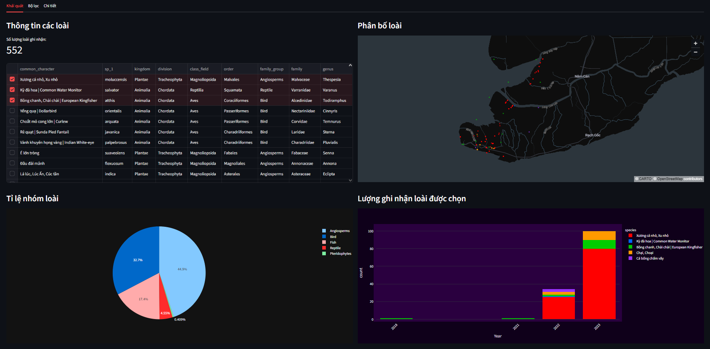
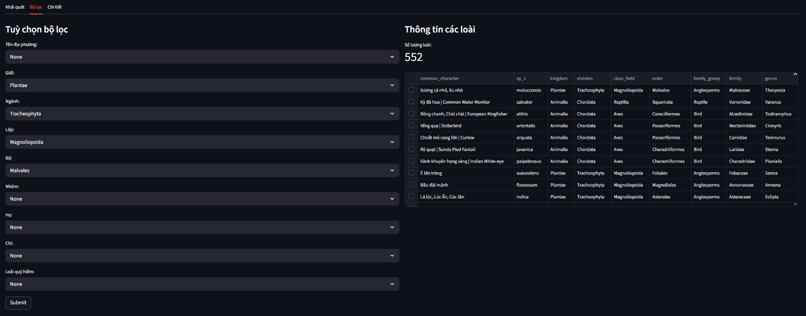
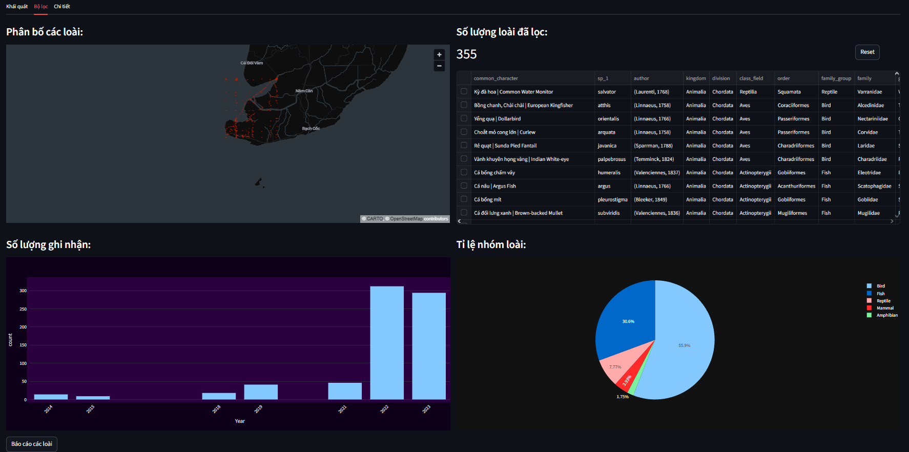
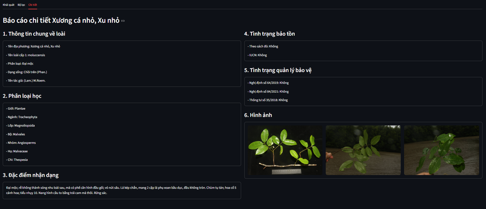
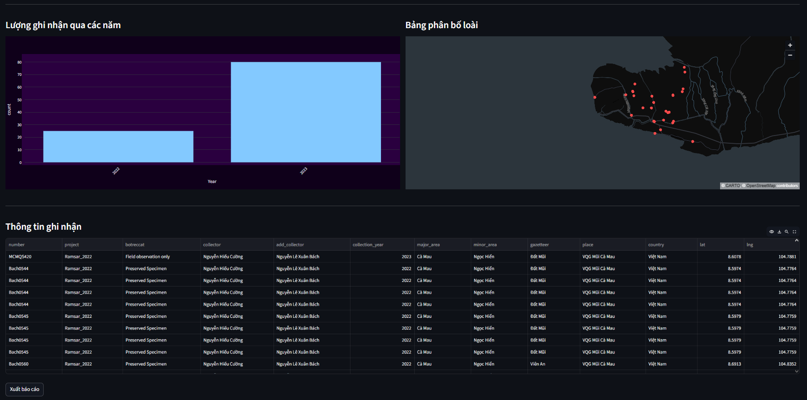

# Species Dashboard

A Streamlit dashboard for visualizing and reporting on species biodiversity data, connected to a PostgreSQL database.

## Project Structure

```
.
├── main.py                             # Main Streamlit app entry point
├── generate_report_tab2.py             # Filtered species Word report generator
├── generate_report_tab3.py             # Single-species Word report generator
├── tab_1.py                            # Tab 1 general view renderer
├── tab_2.py                            # Tab 2 filtered view renderer
├── tab_3.py                            # Tab 3 detail view renderer
├── generate_report_template_tab2.docx  # Word template for filtered species report
├── generate_report_template_tab3.docx  # Word template for single-species report
└── .streamlit/
    └── secrets.toml                 # Database credentials (not committed)
```

## Features

- **Tab 1 – Khái quát**: Overview of all species with interactive map, pie chart, and bar charts.
- **Tab 2 – Bộ lọc**: Filter species by taxonomy, conservation status, and other criteria. Export filtered results as a Word report.
- **Tab 3 – Chi tiết**: Detailed view of a selected species including classification, conservation status, images, collection map, and export to Word report.

## Requirements

Install dependencies:

```bash
pip install -r requirements.txt
```

## Database Configuration

Create a `.streamlit/secrets.toml` file with your PostgreSQL credentials:

```toml
[postgres]
host = "your_host"
port = 5432
dbname = "your_dbname"
user = "your_user"
password = "your_password"
```

## Running the App

```bash
streamlit run main.py
```

## Word Report Templates

Two `.docx` template files are required in the project root:

- `generate_report_template_tab2.docx` — used by `generate_report()` from `generate_report_tab_2()` for filtered species reports. Expected template variables: `species`, `General_location`, `Locations_species`, `Quantity_through_years`, `Species_pie_chart`.
- `generate_report_template_tab3.docx` — used by `generate_report()` from `generate_report_tab_3()` for single-species reports. Expected template variables: `spc`, `general_location`, `locations`, `quantity_through_years`, `image0`–`image3`. 

## Module Overview

| File | Description |
|---|---|
| `main.py` | App entry point. Handles DB queries, session state, data cleaning, and orchestrates all three tabs. |
| `tab_1.py` | Renders Tab 1 overview UI: species table with multi-select, colored distribution map, family group pie chart, and stacked bar chart of records through years. |
| `tab_2.py` | Renders Tab 2 filter UI: taxonomic and conservation status filters, filtered species map, pie chart, bar chart, and Word report export. |
| `tab_3.py` | Renders Tab 3 detail UI: detailed species information, classification, conservation status, images, interactive collection map, and single-species Word report export. |
| `generate_report_tab2.py` | Generates a `.docx` report for a filtered set of species including overview map, distribution map, bar chart, and pie chart. |
| `generate_report_tab3.py` | Generates a detailed `.docx` report for a single species including overview map, distribution map, bar chart, and species images. |

## Screenshots
### Tab 1 - Overview

### Tab 2 - Filter


### Tab 3 - Detail

